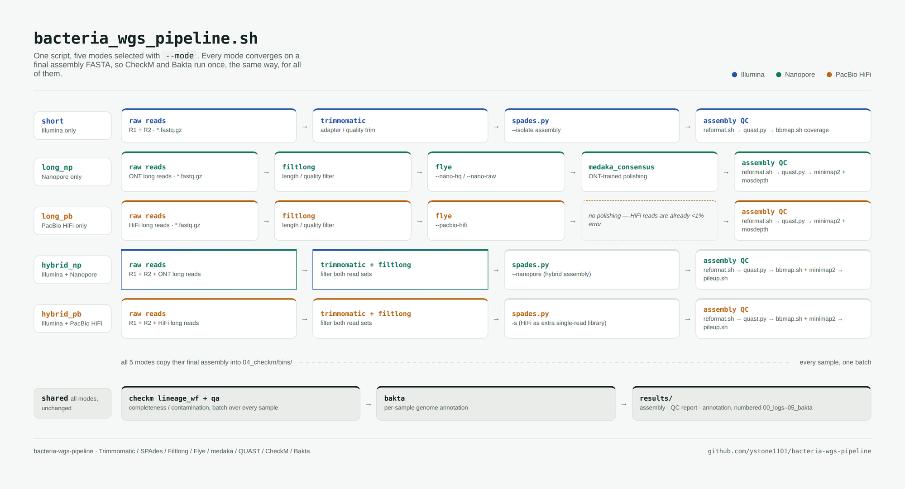

# Bacteria WGS Pipeline



One script for bacterial whole-genome sequencing analysis:
assembly → assembly QC → CheckM → Bakta annotation. `--mode` is required
and selects one of:

- **short** — Illumina paired-end only
  Trimmomatic → SPAdes → reformat.sh → QUAST → BBMap coverage
- **long_np** — Nanopore only
  Filtlong → Flye (`--nano-hq`/`--nano-raw`) → medaka → reformat.sh → QUAST
  → minimap2 (`map-ont`) + mosdepth coverage
- **long_pb** — PacBio HiFi only
  Filtlong → Flye (`--pacbio-hifi`) → reformat.sh → QUAST → minimap2
  (`map-hifi`) + mosdepth coverage
  (no polishing step — medaka is ONT-trained and doesn't apply to HiFi)
- **hybrid_np** — Illumina + Nanopore together
  Trimmomatic + Filtlong → SPAdes `--nanopore` → reformat.sh → QUAST →
  BBMap (short) + minimap2 `map-ont` (long) coverage, plus both merged
  into one combined mosdepth coverage figure
- **hybrid_pb** — Illumina + PacBio HiFi together
  Trimmomatic + Filtlong → SPAdes `-s` (HiFi fed in as an extra single-read
  library — SPAdes has no `--pacbio-hifi` flag; `--pacbio` is for noisy CLR
  reads) → reformat.sh → QUAST → BBMap (short) + minimap2 `map-hifi` (long)
  coverage, plus both merged into one combined mosdepth coverage figure

All modes converge on the same final assembly FASTA, so CheckM (batch, over
every sample) and Bakta annotation run identically regardless of mode.

## Tools

| Tool | Tested version | Used by | Homepage |
|---|---|---|---|
| Trimmomatic | 0.41 | short / hybrid_* | [github.com/usadellab/Trimmomatic](https://github.com/usadellab/Trimmomatic) |
| SPAdes | 4.3.0 | short / hybrid_* | [github.com/ablab/spades](https://github.com/ablab/spades) |
| BBMap / BBTools | 39.81 | short / hybrid_* | [bbmap.org](https://bbmap.org/) |
| Filtlong | 0.3.1 | long_* / hybrid_* | [github.com/rrwick/Filtlong](https://github.com/rrwick/Filtlong) |
| Flye | 2.9.6 | long_* | [github.com/mikolmogorov/Flye](https://github.com/mikolmogorov/Flye) |
| medaka | 2.2.1 | long_np | [github.com/nanoporetech/medaka](https://github.com/nanoporetech/medaka) |
| minimap2 | 2.31 | long_* / hybrid_* | [github.com/lh3/minimap2](https://github.com/lh3/minimap2) |
| samtools | 1.23.1 | long_* / hybrid_* | [github.com/samtools/samtools](https://github.com/samtools/samtools) |
| mosdepth | 0.3.14 | long_* / hybrid_* | [github.com/brentp/mosdepth](https://github.com/brentp/mosdepth) |
| QUAST | 5.3.0 | every mode | [github.com/ablab/quast](https://github.com/ablab/quast) |
| CheckM | 1.2.x | every mode | [github.com/Ecogenomics/CheckM](https://github.com/Ecogenomics/CheckM) |
| Bakta | 1.11.4 | every mode | [github.com/oschwengers/bakta](https://github.com/oschwengers/bakta) |
| pyhmmer | 0.11.4 (`<0.12`) | every mode (Bakta dependency) | [github.com/althonos/pyhmmer](https://github.com/althonos/pyhmmer) |

Versions are what this pipeline was tested against — `environment.yml`
doesn't hard-pin most of them, so newer releases will likely work too,
except `pyhmmer`, which must stay `<0.12` (see [Notes](#notes)). If you're
not using conda, install each of these yourself and make sure it's on
`PATH`; the link in each row goes to that tool's own install instructions.

## Getting started

### 1. Clone the repository

```bash
git clone https://github.com/ystone1101/bacteria-wgs-pipeline.git
cd bacteria-wgs-pipeline
```

### 2. Install the tools

#### Using conda/mamba (recommended)

Requires [conda](https://docs.conda.io/) or [mamba](https://mamba.readthedocs.io/)
(mamba solves much faster). `environment.yml` installs every tool the
pipeline needs into one env called `bacteria_wgs`:

```bash
mamba env create -f environment.yml   # or: conda env create -f environment.yml
```

Activate it and sanity-check the tools:

```bash
conda activate bacteria_wgs

trimmomatic -version
spades.py --version
flye --version
medaka --version
quast.py --version
checkm -h > /dev/null && echo "checkm OK"
bakta --version
```

You'll need to reactivate this env (`conda activate bacteria_wgs`) in every
new terminal session before running the pipeline.

#### Without conda

Install each tool listed in [Tools](#tools) yourself and confirm it's on
`PATH` (e.g. `trimmomatic -version`, `spades.py --version`, ...). There's
no environment to activate — just make sure every tool resolves before you
run the pipeline.

#### Using the Nextflow version instead

There's also a Nextflow DSL2 port of this pipeline under
[`nextflow/`](nextflow/) — same modes, same tool chain, just run through
Nextflow instead of the bash script directly. See
[`nextflow/README.md`](nextflow/README.md) for its own setup and usage. If
you go that route, you additionally need [Nextflow](https://www.nextflow.io/)
itself (>= 23.04) on `PATH`:

```bash
curl -s https://get.nextflow.io | bash
```

on top of the tools above — the Nextflow version reuses the same
`environment.yml` via `-profile conda`, so the rest of this "Install the
tools" step still applies either way.

### 3. Set up reference databases

Two tools need an external database on top of what conda installs — a
one-time download per machine, separate from installing the tools
themselves.

**Bakta** (every mode):

```bash
bakta_db download --output /path/to/bakta_db --type full
```

Point `BAKTA_DB` at the resulting `db/` directory in the next step.

**CheckM** (every mode, unless you pass `--skip-checkm`) — see the
[official CheckM installation guide](https://github.com/Ecogenomics/CheckM/wiki/Installation)
for background/alternatives; the short version:

```bash
mkdir -p ~/checkm_data && cd ~/checkm_data
wget https://data.ace.uq.edu.au/public/CheckM_databases/checkm_data_2015_01_16.tar.gz
tar -xzvf checkm_data_2015_01_16.tar.gz

conda activate bacteria_wgs
checkm data setRoot ~/checkm_data
```

Unlike Bakta, CheckM's data path isn't part of `config.sh` — `checkm data
setRoot <path>` stores it globally per-user
(`~/.checkm`-adjacent config, unrelated to which conda env or project
you're running from), so you only need to do this once per machine. If you
forget this step, CheckM fails partway through `checkm_lineage_wf` with
`FileNotFoundError: ... hmms/phylo.hmm` after everything else in the run
has already finished — re-run the pipeline once this is set up and it
resumes from the CheckM step.

### 4. Set up `config.sh`

`config.sh` holds machine-specific paths (adapter file, Bakta database,
etc.) and is git-ignored — it's meant to stay local, not get committed.
Create your own from the template:

```bash
cp config.example.sh config.sh
```

Then edit `config.sh` and fill in:

| Variable | Used by | Notes |
|---|---|---|
| `THREADS` | every mode | default thread count for every tool |
| `ADAPTER` | short / hybrid_* | Trimmomatic adapter FASTA, absolute path |
| `BAKTA_DB` | every mode | Bakta database directory, absolute path |
| `TMP_DIR` | every mode | Bakta temp directory, absolute path |
| `MIN_LENGTH` | every mode | min contig length kept after assembly |
| `FILTLONG_MIN_LENGTH`, `FILTLONG_KEEP_PERCENT` | long_*/hybrid_* | long-read filtering |
| `FLYE_READ_TYPE` | long_np | `--nano-hq` or `--nano-raw` |
| `MEDAKA_MODEL` | long_np | **no safe default** — must match your basecaller/flow cell/kit, or the pipeline refuses to start; run `medaka tools list_models` to see what's available |
| `FLYE_PACBIO_READ_TYPE` | long_pb | `--pacbio-hifi` or `--pacbio-raw` |

Any of these can also be overridden per-run with a command-line flag
instead of editing `config.sh` (see `-h`).

### 5. (Optional) Put the pipeline on `PATH`

So you can call it as a plain command from any directory, instead of
`cd`-ing into this folder every time:

```bash
mkdir -p ~/tools/bacteria_wgs_pipeline
cp bacteria_wgs_pipeline.sh config.sh ~/tools/bacteria_wgs_pipeline/
chmod +x ~/tools/bacteria_wgs_pipeline/bacteria_wgs_pipeline.sh

conda activate bacteria_wgs
ln -s ~/tools/bacteria_wgs_pipeline/bacteria_wgs_pipeline.sh \
  "$CONDA_PREFIX/bin/bacteria_wgs_pipeline"
```

(Not using conda: symlink into any directory already on your `PATH`
instead of `$CONDA_PREFIX/bin`.)

The script resolves symlinks back to its real directory, so it still finds
`config.sh` next to itself. From then on, `bacteria_wgs_pipeline` works
from any directory. (The examples below use `./bacteria_wgs_pipeline.sh`;
swap in `bacteria_wgs_pipeline` if you did this step.)

### 6. Lay out your reads

Sample names come from the read filenames — pick a folder per read type
and name files by sample:

- Short reads (Illumina): `<sample>_1.fastq.gz`/`<sample>_2.fastq.gz` or
  `<sample>_R1.fastq.gz`/`<sample>_R2.fastq.gz` (both naming conventions
  are recognized)
- Long reads (Nanopore/PacBio): `<sample>.fastq.gz` (one file per sample)

For `hybrid_np`/`hybrid_pb`, the short-read and long-read directories must
use the **same sample name** for the same sample — that's how the script
matches an Illumina pair to its long reads:

```
raw_read/16N2L7_1.fastq.gz   raw_read/16N2L7_2.fastq.gz
raw_long/16N2L7.fastq.gz
```

### 7. Run it

`--mode` is required; the script refuses to run without it.

```bash
# Illumina only: every sample in raw_read/
./bacteria_wgs_pipeline.sh --mode short -r raw_read -o results

# Nanopore only: every sample in raw_long/
./bacteria_wgs_pipeline.sh --mode long_np -l raw_long -o results

# PacBio HiFi only
./bacteria_wgs_pipeline.sh --mode long_pb -l raw_long -o results

# Hybrid: matching samples in both directories
./bacteria_wgs_pipeline.sh --mode hybrid_np -r raw_read -l raw_long -o results
./bacteria_wgs_pipeline.sh --mode hybrid_pb -r raw_read -l raw_long -o results

# Process specific samples only
./bacteria_wgs_pipeline.sh --mode short -r raw_read -o results -s 18H3P11,18H3P12
```

Run `./bacteria_wgs_pipeline.sh -h` for the full option list.

### 8. Check the results

Everything lands under the `-o` directory, numbered so it sorts in
pipeline order:

```
results/
├── 00_logs/         one log file per sample per step
├── 01_QC/<sample>/  trimmed/filtered reads
├── 02_assembly/<sample>/
├── 03_quast/<sample>/  QUAST report + coverage stats
├── 04_checkm/       bins/ (all samples' assemblies) + output/ (batch results)
└── 05_bakta/<sample>/  annotation (gff3, faa, gbff, ...)
```

Progress prints with colored `START`/`DONE`/`FAIL`/`SKIP` status and a
summary at the end; colors auto-disable when output isn't a terminal (e.g.
redirected to a log file).

### 9. If a run fails partway through

Just re-run the same command. Each step is skipped if its expected output
already exists, so you resume right after the failure instead of starting
over. Pass `--force` to re-run every step regardless.

## What each mode does, in detail

For every sample, depending on `--mode`:

- **short**: Trimmomatic (`01_QC/<sample>/`) → SPAdes `--isolate`
  (`02_assembly/<sample>/scaffolds.fasta`)
- **long_np**: Filtlong (`01_QC/<sample>/`) → Flye
  (`02_assembly/<sample>/assembly.fasta`) → medaka polishing
  (`02_assembly/<sample>/medaka/consensus.fasta`)
- **long_pb**: Filtlong → Flye `--pacbio-hifi`
  (`02_assembly/<sample>/assembly.fasta`, used directly — no polishing step)
- **hybrid_np**: Trimmomatic + Filtlong → SPAdes with `--nanopore`
  (`02_assembly/<sample>/scaffolds.fasta`)
- **hybrid_pb**: Trimmomatic + Filtlong → SPAdes with `-s` (HiFi as an
  extra single-read library) (`02_assembly/<sample>/scaffolds.fasta`)

Then, regardless of mode:

- **reformat.sh** drops contigs shorter than `MIN_LENGTH` (default 1000 bp)
  → `scaffolds_final.fasta`
- **QUAST** (`03_quast/<sample>/`) — assembly quality report, fed the
  relevant reads per mode (`--pe1/--pe2` for short reads, `--nanopore` for
  Nanopore, `--pacbio` for PacBio HiFi) so it also reports mapping-based
  metrics, not just bare assembly stats
- **Coverage** (`03_quast/<sample>/`), tool depends on mode:
  - short: `bbmap.sh covstats=` → `coverage_stats.txt`
  - long_np/long_pb: `minimap2` (`map-ont`/`map-hifi`) → sorted/indexed bam
    → `mosdepth` → `<sample>_coverage.mosdepth.summary.txt`
  - hybrid_*: three numbers —
    `bbmap.sh covstats=` → `<sample>_illumina_cov.txt` (short only),
    `minimap2`+`mosdepth` → `<sample>_long_coverage.mosdepth.summary.txt`
    (long only), and both bams coordinate-sorted then combined with
    `samtools merge` → `mosdepth` → `<sample>_total_coverage.mosdepth.summary.txt`
    (short+long combined). The short-read bam needs an explicit
    `samtools sort` first — bbmap.sh's own `out=` isn't coordinate-sorted,
    and `samtools merge` requires matching sort order across inputs, which
    was the actual cause of earlier merge failures. (`pileup.sh`'s `in=`
    was also tried for this — despite appearances, it does not accept a
    comma-separated multi-bam list; it silently reads only the first file.)

Once every sample has a final assembly, they are all copied into
`04_checkm/bins/` and:

- **CheckM** runs once (`lineage_wf` + `qa`) over every sample's assembly
  together, matching how CheckM is normally used across a genome set.

Finally:

- **Bakta** annotates each sample's final assembly (`05_bakta/<sample>/`).

## Notes

- CheckM is a batch step: it is most meaningful once you have multiple
  genomes to compare, so it only runs after all requested samples finish
  assembly. Use `--skip-checkm` to defer it (e.g. when adding a single new
  sample to a set already assessed).
- `bakta<=1.11.4` crashes late in the annotation step (`AttributeError:
  'str' object has no attribute 'decode'`) if paired with `pyhmmer>=0.12`
  — `environment.yml` pins `pyhmmer<0.12` to avoid this.
- `setuptools>=82` (Feb 2026) removed `pkg_resources` entirely, which
  breaks `checkm-genome` (`ModuleNotFoundError: No module named
  'pkg_resources'`) — `environment.yml` pins `setuptools<82` to avoid this.

## References

If you use this pipeline, please cite the underlying tools:

- Bolger AM, Lohse M, Usadel B. Trimmomatic: a flexible trimmer for
  Illumina sequence data. *Bioinformatics*. 2014;30(15):2114–2120.
  [doi:10.1093/bioinformatics/btu170](https://doi.org/10.1093/bioinformatics/btu170)
- Bankevich A, et al. SPAdes: a new genome assembly algorithm and its
  applications to single-cell sequencing. *J Comput Biol*. 2012;19(5):455–477.
  [doi:10.1089/cmb.2012.0021](https://doi.org/10.1089/cmb.2012.0021) — for
  hybrid_np/hybrid_pb, also cite Antipov D, Korobeynikov A, McLean JS,
  Pevzner PA. hybridSPAdes: an algorithm for hybrid assembly of short and
  long reads. *Bioinformatics*. 2016;32(7):1009–1015.
  [doi:10.1093/bioinformatics/btv688](https://doi.org/10.1093/bioinformatics/btv688)
- Kolmogorov M, Yuan J, Lin Y, Pevzner PA. Assembly of long, error-prone
  reads using repeat graphs. *Nat Biotechnol*. 2019;37:540–546.
  [doi:10.1038/s41587-019-0072-8](https://doi.org/10.1038/s41587-019-0072-8)
- Li H. Minimap2: pairwise alignment for nucleotide sequences.
  *Bioinformatics*. 2018;34(18):3094–3100.
  [doi:10.1093/bioinformatics/bty191](https://doi.org/10.1093/bioinformatics/bty191)
- Danecek P, et al. Twelve years of SAMtools and BCFtools. *GigaScience*.
  2021;10(2):giab008.
  [doi:10.1093/gigascience/giab008](https://doi.org/10.1093/gigascience/giab008)
- Pedersen BS, Quinlan AR. Mosdepth: quick coverage calculation for genomes
  and exomes. *Bioinformatics*. 2018;34(5):867–868.
  [doi:10.1093/bioinformatics/btx699](https://doi.org/10.1093/bioinformatics/btx699)
- Gurevich A, Saveliev V, Vyahhi N, Tesler G. QUAST: quality assessment
  tool for genome assemblies. *Bioinformatics*. 2013;29(8):1072–1075.
  [doi:10.1093/bioinformatics/btt086](https://doi.org/10.1093/bioinformatics/btt086)
- Parks DH, Imelfort M, Skennerton CT, Hugenholtz P, Tyson GW. CheckM:
  assessing the quality of microbial genomes recovered from isolates,
  single cells, and metagenomes. *Genome Res*. 2015;25(7):1043–1055.
  [doi:10.1101/gr.186072.114](https://doi.org/10.1101/gr.186072.114)
- Schwengers O, Jelonek L, Dieckmann MA, Beyvers S, Blom J, Goesmann A.
  Bakta: rapid and standardized annotation of bacterial genomes via
  alignment-free sequence identification. *Microb Genom*. 2021;7(11):000685.
  [doi:10.1099/mgen.0.000685](https://doi.org/10.1099/mgen.0.000685)
